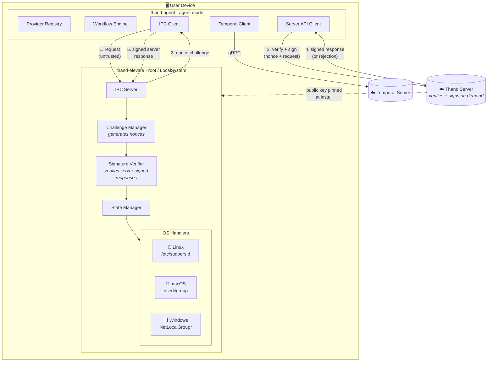
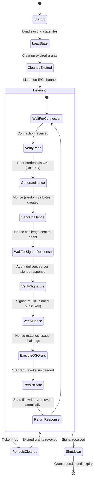
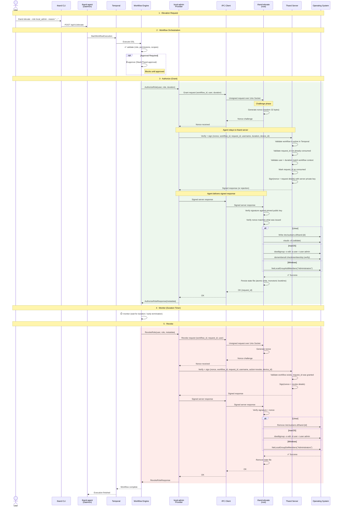

# Local Admin — Architecture Document

## Table of Contents

1. [Overview](#overview)
2. [System Context](#system-context)
3. [Component Architecture](#component-architecture)
4. [Provider Design — `local-admin`](#provider-design--local-admin)
5. [Elevation Helper Daemon](#elevation-helper-daemon)
6. [IPC Protocol](#ipc-protocol)
7. [Per-OS Grant/Revoke Mechanics](#per-os-grantrevoke-mechanics)
8. [State Persistence & Crash Recovery](#state-persistence--crash-recovery)
9. [Security Model](#security-model)
10. [Configuration](#configuration)
11. [Workflow Integration](#workflow-integration)
12. [Implementation Tasks](#implementation-tasks)
13. [Open Questions](#open-questions)

---

## 1. Overview

Temporary, auditable local admin elevation for macOS, Linux, and Windows. The `thand-agent` (running in **agent mode**) communicates with a co-located **elevation helper** over a local IPC channel. The helper runs as root/SYSTEM and performs the actual OS-level privilege change.

This is implemented as a new provider (`local-admin`) that plugs into the existing provider registry, grant/revoke interface (`AuthorizeRole`/`RevokeRole`), and Temporal workflow pipeline — identical to how `aws`, `gcp`, and `cloudflare` providers work today.

**Key invariant:** The `thand-agent` itself never runs as root. All privileged operations are delegated to the elevation helper via IPC.

---

## 2. System Context



**Trust chain:** The thand server is the sole authority. The helper has **zero network access** — it never contacts the outside world. The flow is: (1) the agent sends an unsigned request to the helper, (2) the helper generates a nonce and returns it to the agent, (3) the agent relays the nonce + request to the thand server for verification and signing, (4) the server validates the workflow is active, the request hasn't been consumed, signs the nonce + request, (5) the agent delivers the signed response to the helper, (6) the helper verifies the signature and nonce match before executing. The agent is a relay — it can observe the nonce and signed response but cannot forge, alter, or replay them.

---

## 3. Component Architecture

### New files/packages

> **Implementation status (Feb 2026):** The elevation helper daemon (`cmd/elevate/`) has been implemented for Linux with a sub-package architecture (see below). The agent-side provider (`internal/providers/local-admin/`) has **not yet been created**. macOS and Windows grant engines are not yet implemented.

```
cmd/elevate/                         # Elevation helper daemon (separate Go module: cmd/elevate/go.mod)
    main.go                          # Entry point — wires dependencies, starts server + cleanup, graceful shutdown
    server.go                        # IPC accept loop — delegates connections to handler.Handler
    cleanup.go                       # Startup + periodic expired grant cleanup (monotonic + wall-clock dual strategy)
    cleanup_test.go                  # Unit tests for expiry logic and cleanup sweeps
    go.mod                           # Separate Go module (isolated from main agent module)
    README.md                        # Helper daemon documentation
    clock/
        linux_clock.go               # Linux Clock implementation (/proc/uptime monotonic time)
        linux_clock_test.go
    config/
        config.go                    # Environment-variable-driven configuration (THAND_ELEVATE_* vars)
        config_test.go
    domain/
        types.go                     # Shared domain types: protocol frames, grant state, actions
    grant/
        linux_engine.go              # Linux GrantEngine: sudoers.d drop-in file management
        linux_engine_test.go
    handler/
        interfaces.go                # Central interface definitions (IPCServer, IPCConn, GrantEngine, SignatureVerifier, StateStore, Clock)
        handler.go                   # Per-connection request router (dispatches to grant/revoke handlers)
        handle_grant.go              # Grant action handler (authenticate → grant → persist state)
        handle_revoke.go             # Revoke action handler (authenticate → revoke → delete state)
        auth.go                      # Challenge-response authentication (nonce generation, signature verification)
        errors.go                    # Structured error types (ErrorCode: invalid_request, unauthorized, internal)
        handler_test.go
    ipc/
        ipc_unix.go                  # Unix domain socket IPC server + framed connection (all platforms — Linux, macOS, Windows)
        ipc_unix_test.go
    state/
        store.go                     # JSON file-backed StateStore with atomic writes (single versioned file)
        store_test.go
    verify/
        verifier.go                  # Ed25519 signature verification with pinned trusted keys
        key_parse.go                 # Public key parsing (raw base64 or PEM/PKIX format)
        keys_embedded.go             # Compile-time embedded trusted keys via //go:embed
        keys/                        # Trusted public key PEM files (embedded at build time)
            my-key-example.pem.example
        verifier_test.go
        key_parse_test.go
        keys_embedded_test.go
    tools/
        generate_test_key/
            main.go                  # CLI tool: generates Ed25519 keypairs for testing
        sign_request/
            main.go                  # CLI tool: produces signed request/response frame pairs for testing

internal/providers/local-admin/      # ⚠️ NOT YET IMPLEMENTED — agent-side provider
    main.go                          # Provider registration, Initialize(), config parsing
    elevate.go                       # AuthorizeRole() / RevokeRole() — dispatches to OS-specific grant/revoke
    ipc.go                           # Unix socket client (talks to elevation helper — same transport on all platforms)
    grant_linux.go                   # Linux-specific grant/revoke logic (sudoers.d)
    grant_darwin.go                  # macOS-specific grant/revoke logic (dseditgroup)
    grant_windows.go                 # Windows-specific grant/revoke logic (NetLocalGroup*)
    state.go                         # Grant state persistence (JSON files)
    main_test.go                     # Unit tests
    elevate_test.go                  # Grant/revoke tests
```

### Architecture: Sub-package design

The elevation helper uses a **hub-and-spoke interface pattern** rather than the originally planned flat file layout. Central interfaces are defined in `handler/interfaces.go` and implemented by separate packages:

| Interface | Defined in | Implemented by |
|---|---|---|
| `IPCServer` / `IPCConn` | `handler/interfaces.go` | `ipc/ipc_unix.go` (all platforms) |
| `GrantEngine` | `handler/interfaces.go` | `grant/linux_engine.go` |
| `SignatureVerifier` | `handler/interfaces.go` | `verify/verifier.go` |
| `StateStore` | `handler/interfaces.go` | `state/store.go` |
| `Clock` | `handler/interfaces.go` | `clock/linux_clock.go` |

This enables full dependency injection and testability — every external dependency can be stubbed in unit tests via the interface contracts.

### Existing files touched

| File | Change | Status |
|---|---|---|
| `internal/models/provider.go` | No change — declares `ProviderCapabilityRBAC` (code-level capability flag for grant/revoke) | N/A |
| `internal/models/provider_rbac.go` | No change — `AuthorizeRole`/`RevokeRole` interface already sufficient for elevation | N/A |
| `internal/providers/registry.go` | No change — self-registration via `init()` | N/A |
| `examples/roles/` | New `local-admin.example.yml` | ⚠️ Not yet created |
| `examples/providers/` | New `local-admin.example.yaml` | ⚠️ Not yet created |

---

## 4. Provider Design — `local-admin`

### Registration

```go
// internal/providers/local-admin/main.go
package localadmin

import (
    "github.com/thand-io/agent/internal/models"
    "github.com/thand-io/agent/internal/providers"
)

type localAdminProvider struct {
    *models.BaseProvider
    ipcClient    *IPCClient     // connection to elevation helper
    serverClient *ServerClient  // connection to thand server (relay for nonce signing)
}

func init() {
    providers.Register("local-admin", &localAdminProvider{})
}

func (p *localAdminProvider) Initialize(provider models.Provider) error {
    p.BaseProvider = models.NewBaseProvider(
        provider,
        models.ProviderCapabilityRBAC, // code-level flag — enables AuthorizeRole/RevokeRole
    )

    socketPath := provider.Config.GetString("socket_path", defaultSocketPath())
    p.ipcClient = NewIPCClient(socketPath)
    p.serverClient = NewServerClient(provider.Config) // thand server URL, auth, etc.

    return p.ipcClient.HealthCheck()
}
```

### Grant / Revoke Implementation

```go
// internal/providers/local-admin/elevate.go

func (p *localAdminProvider) AuthorizeRole(
    ctx context.Context,
    req *models.AuthorizeRoleRequest,
) (*models.AuthorizeRoleResponse, error) {

    // 1. Build grant request
    grantReq := &GrantRequest{
        RequestID:  uuid.NewString(),
        Username:   resolveUsername(req),  // from identity or last active user
        Duration:   req.GetDuration(),
        Role:       req.GetRole(),
        GrantedAt:  time.Now().UTC(),
    }

    // 2. Send to elevation helper via IPC (3-phase: request → challenge → signed response)
    //    Phase 1: Send unsigned request, get nonce challenge back
    //    Phase 2: Relay nonce + request to thand server, get signed response
    //    Phase 3: Deliver signed response to helper, get final result
    grantResp, err := p.ipcClient.Grant(ctx, grantReq, p.serverClient)
    if err != nil {
        return nil, fmt.Errorf("local-admin grant failed: %w", err)
    }

    // 3. Return metadata for later revocation
    return &models.AuthorizeRoleResponse{
        UserId: grantReq.Username,
        Metadata: map[string]any{
            "request_id": grantReq.RequestID,
            "username":   grantReq.Username,
            "granted_at": grantReq.GrantedAt,
            "expiry":     grantResp.Expiry,
            "os":         runtime.GOOS,
        },
    }, nil
}

func (p *localAdminProvider) RevokeRole(
    ctx context.Context,
    req *models.RevokeRoleRequest,
) (*models.RevokeRoleResponse, error) {

    requestID := req.AuthorizeRoleResponse.Metadata["request_id"].(string)
    username := req.AuthorizeRoleResponse.Metadata["username"].(string)

    // Send revoke to elevation helper via IPC
    err := p.ipcClient.Revoke(ctx, &RevokeRequest{
        RequestID: requestID,
        Username:  username,
    })
    if err != nil {
        return nil, fmt.Errorf("local-admin revoke failed: %w", err)
    }

    return &models.RevokeRoleResponse{}, nil
}
```

---

## 5. Elevation Helper Daemon

A standalone binary (`thand-elevate`) installed alongside the agent, built as a **separate Go module** (`cmd/elevate/go.mod`). It:

- Runs as **root** (Linux/macOS via systemd/launchd) or **LocalSystem** (Windows service)
- Listens on a **Unix domain socket** on all platforms (Linux, macOS, and Windows all support Unix domain sockets natively)
- Accepts only connections from the `thand-agent` process (verified via peer credentials)
- Performs challenge-response signature verification on every request
- Manages grant state files on disk for crash recovery
- Runs periodic cleanup of expired grants

### Lifecycle



---

## 6. IPC Protocol

### Transport

Unix domain sockets are used on **all platforms**. Windows has supported Unix domain sockets natively since Windows 10 1803 / Windows Server 2019, eliminating the need for platform-specific named pipe code.

| OS | Transport | Path |
|---|---|---|
| Linux | Unix domain socket | `/var/run/thand/elevate.sock` |
| macOS | Unix domain socket | `/var/run/thand/elevate.sock` |
| Windows | Unix domain socket | `C:\ProgramData\thand\elevate.sock` |

### Message Format

JSON over the IPC channel, newline-delimited. The agent is **untrusted** — it is a relay between the helper and the thand server. The helper has **zero network access**. The helper generates a nonce challenge, the agent relays the nonce to the thand server for verification and signing, and the agent delivers the signed response back to the helper. No tokens, timestamps, or clocks are involved in the trust model.

The IPC connection stays open for the full request lifecycle (all 3 phases happen on the same socket connection).

**Phase 1 — Agent sends unsigned request to helper:**

```json
{
  "type": "request",
  "action": "grant",
  "workflow_id": "elevation-workflow-abc",
  "request_id": "grant-request-123",
  "username": "luke.hawkins",
  "duration_seconds": 3600
}
```

This is untrusted data. The helper does not act on it directly.

**Phase 2 — Helper generates nonce, returns challenge to agent:**

```json
{
  "type": "challenge",
  "nonce": "helper-generated-random-32-bytes-base64"
}
```

The nonce is held in memory for the duration of this single request only — never persisted, never reused. The helper is now waiting on the same connection for the agent to deliver a signed response.

**Phase 3a — Agent relays to thand server:**

The agent (not the helper) calls the thand server over HTTPS:

```json
// Agent → Thand Server (HTTPS)
POST /api/v1/elevate/verify
{
  "nonce": "helper-generated-random-32-bytes-base64",
  "workflow_id": "elevation-workflow-abc",
  "request_id": "grant-request-123",
  "action": "grant",
  "username": "luke.hawkins",
  "duration_seconds": 3600,
  "device_id": "machine-fingerprint"
}
```

The server:
1. Validates the workflow is **active** in Temporal right now
2. Validates `request_id` has **not already been consumed**
3. Validates `username`, `duration_seconds`, and `action` match the workflow context
4. Validates `device_id` matches the device registered for this workflow
5. **Marks `request_id` as consumed** (server-side, persistent)
6. Signs `(nonce | action | workflow_id | request_id | username | duration_seconds | device_id)` with the server's private key

**Phase 3b — Server responds to agent:**

```json
// Thand Server → Agent
{
  "status": "ok",
  "signature": "base64-ed25519-sig",
  "key_id": "thand-server-key-2026-02",
  "signed_payload": "base64-of-canonical-payload"
}
```

Or rejection:
```json
{
  "status": "error",
  "error": "request_id already consumed"
}
```

If the server rejects, the agent sends an error frame to the helper and the connection closes.

**Phase 4 — Agent delivers signed response to helper:**

```json
{
  "type": "signed_response",
  "signature": "base64-ed25519-sig",
  "key_id": "thand-server-key-2026-02",
  "signed_payload": "base64-of-canonical-payload"
}
```

**Phase 5 — Helper verifies and executes:**

The helper:
1. Verifies the signature against the thand server's pinned public key (matched by `key_id`)
2. Decodes `signed_payload` and verifies it contains the **exact nonce** it generated
3. Verifies the payload fields (`action`, `workflow_id`, `request_id`, `username`, `duration_seconds`) match the original request from Phase 1
4. Executes the OS-specific grant/revoke
5. Persists/removes the state file

**Phase 6 — Helper responds to agent:**

```json
{
  "type": "result",
  "status": "ok|error",
  "error": "optional error message",
  "request_id": "grant-request-123"
}
```

### Verification Flow

1. **Peer credentials** — On connect, the helper reads `SO_PEERCRED` (Linux) or `getpeereid()` (macOS) to verify the connecting process UID matches the `thand-agent` user. On Windows, socket file ACLs restrict access. First-pass filter only.
2. **Nonce generation** — The helper generates a cryptographically random nonce (32 bytes). This nonce is held in memory for the duration of this single request only — it is never persisted and never reused. The nonce is returned to the agent as a challenge.
3. **Agent relay** — The agent sends the nonce + request details to the thand server over HTTPS. The server verifies the request is legitimate (workflow active, request not consumed, parameters match) and signs the nonce + request. **This is the trust boundary** — the server is the sole authority. The agent is a relay only — it cannot influence the server's decision.
4. **Signed response delivery** — The agent delivers the server's signed response back to the helper over the same IPC connection.
5. **Signature verification** — The helper verifies the server's signature against its pinned public key. The nonce binds the signature to this specific request on this specific invocation.
6. **Nonce + payload match** — The helper confirms the signed payload contains the exact nonce it generated AND that the request fields in the payload match the original request from Phase 1. This prevents replay (wrong nonce) and parameter tampering (agent altered fields between Phase 1 and Phase 3a).
7. **Execution** — Only after all checks pass does the helper execute the OS-specific grant or revoke.

### Why this is non-replayable

| Attack | Why it fails |
|---|---|
| Restart helper, replay old server response | Nonce is gone from memory. New invocation generates a new nonce. Old signature won't match. |
| Intercept server response, use it later | Nonce won't match — each invocation gets a unique nonce. |
| Send the same request twice | Server marks `request_id` as consumed on first call. Second call is rejected server-side. |
| Change system clock | No timestamps are used anywhere in the verification flow. |
| Compromise the agent | Agent is a relay only. It can see the nonce and signed response but cannot forge a server signature, cannot alter the signed payload, and cannot replay (nonce is single-use). |
| Tamper with request fields between phases | Helper compares signed payload fields against the original Phase 1 request. If the agent sent different parameters to the server, the helper rejects. |
| Exfiltrate request to another device | `device_id` won't match. Server rejects. |

---

## 7. Per-OS Grant/Revoke Mechanics

### Linux — sudoers.d

**Grant:**
1. Write file `/etc/sudoers.d/thand-<request_id>` with content:
   ```
   # thand-agent temporary elevation
   # request_id: <request_id>
   # expires: <ISO8601>
   <username> ALL=(ALL:ALL) NOPASSWD: ALL
   ```
2. Validate with `visudo -cf /etc/sudoers.d/thand-<request_id>`
3. Set permissions: owner `root:root`, mode `0440`
4. Write state file

**Revoke:**
1. Remove `/etc/sudoers.d/thand-<request_id>`
2. Remove state file

### macOS — Directory Services

**Grant:**
1. Execute: `dseditgroup -o edit -a <username> -t user admin`
2. Verify: `dsmemberutil checkmembership -U <username> -G admin`
3. Write state file

**Revoke:**
1. Execute: `dseditgroup -o edit -d <username> -t user admin`
2. Verify: `dsmemberutil checkmembership -U <username> -G admin` (expect "not a member")
3. Remove state file

**Note:** Since `dseditgroup` is idempotent (adding an already-member is a no-op, removing a non-member is a no-op), the crash recovery path is safe.

### Windows — NetLocalGroup

**Grant:**
1. Call `NetLocalGroupAddMembers(NULL, "Administrators", 3, &memberInfo, 1)`
   - Or PowerShell fallback: `Add-LocalGroupMember -Group "Administrators" -Member <username>`
2. Verify: `net localgroup Administrators | findstr <username>`
3. Write state file

**Revoke:**
1. Call `NetLocalGroupDelMembers(NULL, "Administrators", 3, &memberInfo, 1)`
   - Or PowerShell fallback: `Remove-LocalGroupMember -Group "Administrators" -Member <username>`
2. Verify removal
3. Remove state file

---

## 8. State Persistence & Crash Recovery

### State Directory

| OS | Path | Notes |
|---|---|---|
| Linux | Configurable via `THAND_ELEVATE_STATE_PATH` (default: `/var/lib/thand/elevate/state.json`) | Single versioned JSON file |
| macOS | Same env var, same default path | Not yet implemented |
| Windows | Configurable via `THAND_ELEVATE_STATE_PATH` (default: `C:\ProgramData\thand\elevate\state.json`) | Not yet implemented |

### State File Format

> **Deviation from original design:** The implementation uses a **single versioned JSON file** containing all active grants, rather than one file per grant. This simplifies atomic updates and avoids filesystem scanning.

The state file is a single JSON document managed by `state/store.go`:

```json
{
  "version": 1,
  "grants": [
    {
      "request_id": "abc-123",
      "username": "luke.hawkins",
      "granted_at_wall_utc": "2026-02-20T10:00:00Z",
      "granted_at_mono_ns": 182745000000000,
      "duration_seconds": 3600,
      "was_already_privileged": false
    }
  ]
}
```

**Key design:** Expiry is computed using a **dual-clock strategy** — the implementation prefers monotonic time but falls back to wall clock after reboot detection.

- **`granted_at_mono_ns`** — Captured from `/proc/uptime` (Linux). These clocks are not adjustable by any user, including root.
- **`granted_at_wall_utc`** — Wall clock, used as fallback for expiry after reboot detection (when monotonic time resets). Also used for audit logging.
- **`duration_seconds`** — The approved grant duration. Immutable once written.
- **`was_already_privileged`** — Tracks whether the user was already in the privileged group before the grant, informing revoke behavior.

Written atomically: `MkdirAll` → `CreateTemp` → write → `Sync` → `Rename` → directory `Sync` (full fsync pipeline).

Owner `root` / `SYSTEM`, mode `0600`.

### Recovery

On startup and periodically (configurable via `THAND_ELEVATE_CLEANUP_INTERVAL`, default `1m`), the `CleanupRunner`:

1. Lists all grants from the single state file
2. For each grant, checks expiry using dual-clock logic:
   - **Primary:** If `current_mono_ns >= granted_at_mono_ns`, compute elapsed monotonic time. If `elapsed >= duration_seconds` → expired.
   - **Reboot fallback:** If `current_mono_ns < granted_at_mono_ns` (boot-time epoch changed), fall back to wall clock: if `now_wall_utc - granted_at_wall_utc >= duration_seconds` → expired.
   - **Always expired:** If `duration_seconds <= 0` → treated as immediately expired.
3. For expired grants:
   a. Execute the OS-specific revoke via `GrantEngine.Revoke()`
   b. Remove the grant from the state file via `StateStore.Delete()`
   c. Log the cleanup action
4. **Reboot handling:** After a reboot, monotonic time resets to near zero. The cleanup runner detects this and falls back to wall-clock expiry, which still results in timely revocation. This means **reboots do not silently extend grants**.
5. Treat "already revoked" (user not in group, sudoers file missing) as success

---

## 9. Security Model

### Threat: Root/SYSTEM compromise of the helper
- **Mitigation:** The helper is a minimal binary with **zero network access** — it never makes outbound connections. No inbound listeners beyond the local IPC socket. No shell invocation beyond the specific OS elevation calls. Its attack surface is limited to: (1) the IPC socket, (2) the pinned public key file, (3) the state directory. Code is kept as small as possible.

### Threat: Clock manipulation to extend elevation
- **Scenario:** An elevated user has admin/root. They set the system clock backwards to prevent their grant from expiring.
- **Mitigation (Verification):** The IPC verification flow uses **zero timestamps**. The helper generates a nonce, the server validates and signs it in real-time. No clocks, no expiry windows, no time comparisons. Changing the clock has no effect on the verification handshake.
- **Mitigation (Grant expiry):** Grant state files store `granted_at_mono_ns` from `/proc/uptime` (Linux) — a monotonic clock that is not adjustable even by root. Expiry is computed as monotonic elapsed time, with wall-clock fallback after reboot detection. Changing the system date/time has zero effect on when grants expire.
- **Mitigation (Reboot):** If the system reboots, the monotonic clock resets. The helper detects this (`current_mono_ns < granted_at_mono_ns`) and falls back to wall-clock expiry, which still results in timely revocation.

### Threat: Compromised agent process
- **Scenario:** An elevated user compromises the `thand-agent` process or a process running as the same UID attempts to send forged requests to the helper.
- **Mitigation:** The agent is an untrusted relay. It sends unsigned request data to the helper, receives a nonce challenge, relays the nonce to the thand server, and delivers the signed response back to the helper. The agent cannot forge a server signature, and the helper cross-checks the signed payload against the original Phase 1 request — if the agent altered any fields when relaying to the server, the helper detects the mismatch and rejects. The agent cannot replay old signed responses because each invocation uses a fresh nonce.

### Threat: Replay attacks
- **Mitigation (Nonce):** Each invocation uses a fresh helper-generated nonce. A server response signed for nonce A is useless for nonce B. Restarting the helper destroys the nonce — old responses are dead.
- **Mitigation (Server-side consumption):** The thand server marks each `request_id` as consumed on first verification. Sending the same `request_id` again → rejected server-side, regardless of helper state.
- **Mitigation (No local state dependency):** The anti-replay guarantee lives on the server, not in the helper's memory. Restarting the helper, clearing local files, or any other local manipulation cannot bypass it.

### Threat: Network outage (agent cannot reach thand server)
- **Mitigation:** Grant requests fail — the agent cannot obtain a signed response without server contact, and the helper will not execute without one. This is by design: no server contact = no elevation. For revocation, the helper can still revoke locally based on state file expiry (monotonic boottime) even without server contact, since revocation is a safe-by-default operation.

### Threat: Unauthorized IPC connection
- **Mitigation:** Socket file permissions (`srw-rw---- root:thand-agent`) and peer credential verification (Linux/macOS) or socket file ACLs (Windows) provide a first-pass filter. The real trust boundary is the server-side verification — without a valid, unconsumed workflow in Temporal, the server rejects the request regardless of who submitted it.

### Threat: Key compromise (thand server signing key)
- **Mitigation:** The server's signing key is the single root of trust. It is protected by the thand server's infrastructure (HSM, KMS, or equivalent). Key rotation is supported via `key_id` — the helper maintains a small set of trusted public keys, updatable via a signed key-rotation message. Compromised keys can be revoked server-side.

### Threat: Stale grants after crash/reboot
- **Mitigation:** Persistent state file (single versioned JSON) with dual timestamps (monotonic + wall). `CleanupRunner` runs at startup and periodically (configurable via `THAND_ELEVATE_CLEANUP_INTERVAL`, default `1m`) using dual-clock expiry: prefers monotonic, falls back to wall clock after reboot detection. The OS-level revocation calls are idempotent.

### Threat: AD/Intune/GPO managed Windows devices
- **Mitigation:** Out of scope per the spec (no Local AD or Hybrid AD interaction). The helper operates on local accounts only.

---

## 10. Configuration

### Elevation Helper Configuration

The elevation helper daemon (`thand-elevate`) is configured via environment variables (loaded in `config/config.go`):

| Environment Variable | Default | Description |
|---|---|---|
| `THAND_ELEVATE_SOCKET_PATH` | `/var/run/thand/elevate.sock` | Unix socket path for IPC |
| `THAND_ELEVATE_SUDOERS_DIR` | `/etc/sudoers.d` | Directory for temporary sudoers drop-in files |
| `THAND_ELEVATE_SUDOERS_FILE` | `/etc/sudoers` | Main sudoers file (checked for `#includedir`) |
| `THAND_ELEVATE_VISUDO_BIN` | `visudo` | Path to visudo binary for syntax validation |
| `THAND_ELEVATE_STATE_PATH` | `/var/lib/thand/elevate/state.json` | State file for grant persistence |
| `THAND_ELEVATE_CLEANUP_INTERVAL` | `1m` | How often to sweep for expired grants |
| `THAND_ELEVATE_REQUEST_TIMEOUT` | `30s` | Timeout for a single IPC request lifecycle |
| `THAND_ELEVATE_SOCKET_GID` | `-1` (disabled) | GID for socket directory/file ownership |
| `THAND_ELEVATE_LOG_LEVEL` | `info` | Log level (`debug`, `info`, `warn`, `error`) |

### Provider Definition

```yaml
# examples/providers/local-admin.example.yaml
version: "1.0"
providers:
  local-admin:
    name: local-admin
    description: Temporary local admin elevation
    provider: local-admin
    config:
      # Socket path (auto-detected per OS if omitted)
      # socket_path: /var/run/thand/elevate.sock
      
      # Default elevation duration (ISO 8601), can be overridden per-role
      default_duration: PT60M
      
      # Maximum allowed duration
      max_duration: PT24H
    enabled: true
```

### Role Definition

```yaml
# examples/roles/local-admin.example.yml
version: "1.0"
roles:
  local_admin_standard:
    name: Standard Local Admin
    description: Temporary local admin for software installation and troubleshooting.
    authenticators: [google_oauth2]
    workflows: [slack_approval]
    permissions:
      allow: ["local-admin:elevate"]
    resources:
      allow: ["local:*"]
    scopes:
      groups: [oidc:engineering, oidc:it-support]
    providers: [local-admin]
    enabled: true

  local_admin_emergency:
    name: Emergency Local Admin
    description: Extended local admin elevation for emergencies. Requires manager approval.
    authenticators: [google_oauth2]
    workflows: [thand_approvals]
    permissions:
      allow: ["local-admin:elevate"]
    resources:
      allow: ["local:*"]
    providers: [local-admin]
    enabled: true
```

---

## 11. Workflow Integration

The `local-admin` provider integrates into the existing elevation workflow pipeline with **zero changes** to the workflow engine:



The Temporal cleanup/termination handler also works unchanged — if the workflow is terminated early, the `$cleanup` step calls `RevokeRole`, which revokes via the helper.

---

## 12. Implementation Tasks

### T1: Core provider scaffold + IPC client
**Status:** ⚠️ Not started

**Do:** Create `internal/providers/local-admin/` with `main.go` (registration, init), `ipc.go` (Unix socket client — same transport on all platforms), `state.go` (state model). Stub `AuthorizeRole`/`RevokeRole` that return not-implemented.

**Files:** `internal/providers/local-admin/main.go`, `ipc.go`, `state.go`, `main_test.go`

**Verify:** `go build ./internal/providers/local-admin/...` compiles. Unit tests for IPC client mock pass.

---

### T2: Elevation helper daemon — core + IPC server
**Status:** ✅ Complete (Linux)

**Do:** ~~Create `cmd/elevate/` with `main.go`, `server.go` (IPC listener), `handler.go` (request dispatch), `security.go` (peer creds + signature verification), `cleanup.go` (state scanner), `state.go` (atomic file ops).~~

**Implemented as a sub-package architecture** (separate Go module `cmd/elevate/go.mod`):

| Package | Files | Purpose |
|---|---|---|
| `cmd/elevate/` (root) | `main.go`, `server.go`, `cleanup.go`, `cleanup_test.go` | Entry point, IPC accept loop, cleanup runner |
| `cmd/elevate/config/` | `config.go`, `config_test.go` | Environment-variable-driven configuration (`THAND_ELEVATE_*`) |
| `cmd/elevate/domain/` | `types.go` | Shared domain types: protocol frames, grant state, action constants |
| `cmd/elevate/handler/` | `interfaces.go`, `handler.go`, `handle_grant.go`, `handle_revoke.go`, `auth.go`, `errors.go`, `handler_test.go` | Central interfaces, per-connection routing, challenge-response auth, structured errors |
| `cmd/elevate/ipc/` | `ipc_unix.go`, `ipc_unix_test.go` | Unix domain socket IPC server + newline-delimited framing |
| `cmd/elevate/grant/` | `linux_engine.go`, `linux_engine_test.go` | Linux `GrantEngine`: sudoers.d drop-in file management |
| `cmd/elevate/state/` | `store.go`, `store_test.go` | Single versioned JSON state file with atomic writes |
| `cmd/elevate/verify/` | `verifier.go`, `key_parse.go`, `keys_embedded.go`, `keys/`, tests | Ed25519 signature verification, key parsing (PEM/base64), embedded trusted keys |
| `cmd/elevate/clock/` | `linux_clock.go`, `linux_clock_test.go` | Linux monotonic clock via `/proc/uptime` |
| `cmd/elevate/tools/` | `generate_test_key/main.go`, `sign_request/main.go` | Testing utilities: keypair generation, signed frame production |

**Verify:** `cd cmd/elevate && go build ./...` compiles. `go test ./...` passes. ✅

---

### T3: Linux grant/revoke implementation
**Status:** ✅ Complete (helper-side)

**Done:** Implemented `grant/linux_engine.go` in the helper (sudoers.d file write/remove with `visudo` validation). The agent-side provider (`internal/providers/local-admin/grant_linux.go`) is **not yet implemented** (depends on T1).

**Implemented files:** `cmd/elevate/grant/linux_engine.go`, `cmd/elevate/grant/linux_engine_test.go`

**Verify:** `cd cmd/elevate && go test ./grant/...` on Linux. ✅

---

### T4: macOS grant/revoke implementation
**Status:** ⚠️ Not started

**Do:** Implement `grant/darwin_engine.go` in the helper (`dseditgroup` calls), `clock/darwin_clock.go` for macOS monotonic time, and `grant_darwin.go` in the provider.

**Files:** `cmd/elevate/grant/darwin_engine.go`, `cmd/elevate/clock/darwin_clock.go`, `internal/providers/local-admin/grant_darwin.go`

**Verify:** `cd cmd/elevate && go test ./...` on macOS. Manual: grant adds user to admin group, revoke removes, cleanup handles expired.

---

### T5: Windows grant/revoke implementation
**Status:** ⚠️ Not started

**Do:** Implement `grant/windows_engine.go` in the helper (`NetLocalGroupAddMembers`/`NetLocalGroupDelMembers` via `golang.org/x/sys/windows`), `clock/windows_clock.go`, and `grant_windows.go` in the provider. IPC uses the same Unix domain socket implementation as Linux/macOS (no platform-specific IPC code needed).

**Files:** `cmd/elevate/grant/windows_engine.go`, `cmd/elevate/clock/windows_clock.go`, `internal/providers/local-admin/grant_windows.go`

**Verify:** `cd cmd/elevate && go test ./...` on Windows. Manual: grant adds user to Administrators, revoke removes.

---

### T6: Example configs + documentation
**Status:** ⚠️ Not started

**Do:** Add `examples/providers/local-admin.example.yaml`, `examples/roles/local-admin.example.yml`, update docs.

**Files:** `examples/providers/local-admin.example.yaml`, `examples/roles/local-admin.example.yml`, `docs/configuration/providers/local-admin.md`

**Verify:** Example configs parse without error. Docs render correctly.

---

## 13. Open Questions

1. **Helper installation:** Is `thand-elevate` bundled in the same package as `thand-agent`, or distributed separately? The systemd/launchd/Windows service unit files need to be created. **Note:** The helper is now a separate Go module (`cmd/elevate/go.mod`), which supports independent builds. This is NOT going to be bundled together.

2. **Audit logging:** Where should grant/revoke audit events be sent? This will be sent to temporal.